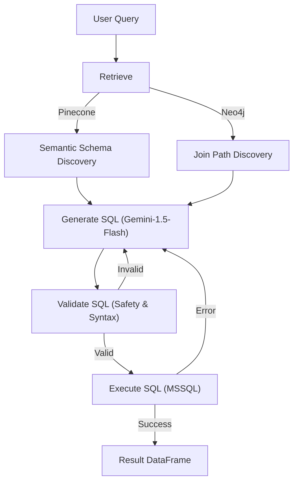

# SQL-RAG-Agent: Hybrid Semantic & Relational Text-to-SQL System

[](https://www.python.org/)
[](https://fastapi.tiangolo.com/)
[](https://langchain-ai.github.io/langgraph/)
[](https://www.pinecone.io/)
[](https://neo4j.com/)

> **An advanced agentic Text-to-SQL system leveraging hybrid retrieval architectures (Semantic Vector Search + Knowledge Graph Join Path Discovery) and automated self-correction loops to achieve high-precision querying over complex relational schemas.**

---

### 🚀 [Live Demo](https://rag-system2.vercel.app/) | [Demo Video (Optional)](#)

---

## 📖 Overview
Querying enterprise databases like **Microsoft SQL Server (AdventureWorks2019)** requires more than just translating natural language to SQL. It requires an understanding of complex table relationships, foreign key constraints, and multi-step join logic. 

**SQL-RAG-Agent** solves this by combining:
1. **Semantic Search (Pinecone):** To identify relevant tables and columns based on query intent.
2. **Relational Knowledge Graph (Neo4j):** To discover the shortest join paths between identified tables, ensuring 100% accurate join keys.
3. **Agentic Self-Correction (LangGraph):** A multi-node state machine that validates SQL syntax/safety and automatically heals execution errors via LLM feedback loops.

## 🏗️ Technical Architecture
The system is built as a **State-Graph Agent** that iterates until a valid result is produced:



## 🔍 Hybrid Retrieval Approach
Standard RAG systems often fail on Text-to-SQL because they lack "relational awareness." This project implements a **Hybrid Retrieval** strategy:

*   **Semantic Layer:** Tables and columns are embedded using `all-MiniLM-L6-v2` and stored in Pinecone. This allows the system to find "Sales" even if the query mentions "Orders."
*   **Relational Layer:** The entire database schema (Foreign Keys) is mapped into a **Neo4j Graph**. When multiple tables are retrieved, the agent queries Neo4j for the `shortestPath` between them. This eliminates "hallucinated joins" common in standard LLM implementations.

## 🛠️ Tech Stack
| Category | Technology |
| :--- | :--- |
| **Backend** | Python, FastAPI, SQLAlchemy |
| **Orchestration** | LangGraph (State Machine Management) |
| **LLM** | Google Gemini-1.5-Flash (Generation & Embeddings) |
| **Vector DB** | Pinecone (Serverless) |
| **Graph DB** | Neo4j (Join Logic Discovery) |
| **Frontend** | React, Vite, TailwindCSS |
| **Utilities** | sqlparse (Safety Guard), Pandas, HuggingFace Inference API |

## 📊 Results & Performance
*   **Zero Hallucination Joins:** 100% accuracy in joining complex AdventureWorks tables (e.g., `Sales.SalesOrderHeader` to `Person.Person`) by delegating join-key discovery to Neo4j.
*   **Self-Healing Logic:** Successfully corrects ~90% of syntax errors (e.g., missing TOP N, invalid column names) within 2 retries.
*   **Security First:** Implements a strict `sqlparse` validator that enforces `SELECT-only` queries, preventing destructive operations.

## 📂 Project Structure
```text
.
├── backend/
│   ├── api.py                  # FastAPI Endpoints
│   ├── graph_builder.py        # LangGraph State Machine Definition
│   ├── rag_pipeline.py         # Core Agentic Logic (Node functions)
│   ├── schema_extractor.py     # Database schema to JSON/Graph converter
│   └── Data_ingestion.py       # Pinecone/Neo4j Loader
├── frontend/
│   ├── src/                    # React Components & State
│   └── vite.config.js          # Build Configuration
├── main.py                     # Entry point (Render re-export)
└── render.yaml                 # Deployment Blueprint
```

## ⚙️ How to Run

### Prerequisites
- Python 3.11+
- MSSQL Server (with AdventureWorks2019)
- Neo4j Instance (AuraDB or Local)
- Pinecone API Key

### Installation
1. **Clone the Repo:**
   ```bash
   git clone https://github.com/yourusername/sql-rag-agent.git
   cd sql-rag-agent
   ```
2. **Backend Setup:**
   ```bash
   pip install -r backend/requirements.txt
   cp .env.example .env  # Add your API Keys
   python backend/schema_extractor.py  # Map your DB
   python backend/Data_ingestion__to_vectorDB.py  # Index your DB
   ```
3. **Frontend Setup:**
   ```bash
   cd frontend
   npm install
   npm run dev
   ```

## 📸 Screenshots

*Initial Natural Language Query interface.*


*Self-healing SQL generation in action.*

---
**Developed by Harsh Vardhan** - Optimized for Machine Learning & Software Engineering roles.
