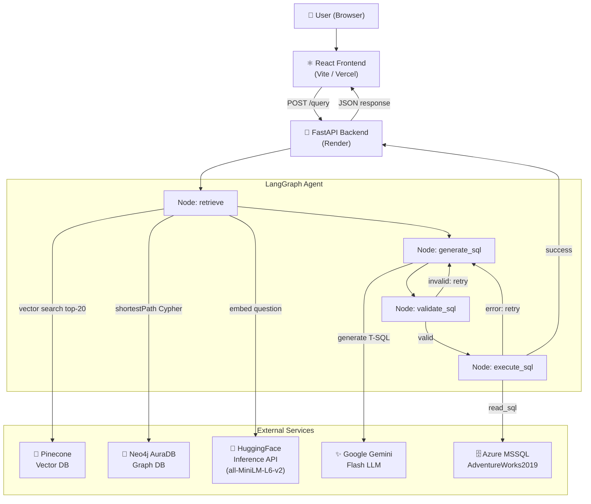

# SQL RAG System — Full Project Analysis

## Project Overview

This is an **Agentic Hybrid SQL RAG (Retrieval-Augmented Generation) System** that converts natural language questions into executable T-SQL queries against a Microsoft SQL Server **AdventureWorks2019** database. It combines semantic vector search, graph-based relational retrieval, LLM-powered SQL generation, and a self-correction loop — all orchestrated by a LangGraph agent.

---

## Architecture Diagram



---

## Project Structure

```
SQL RAG System/
├── backend/
│   ├── api.py                         # FastAPI app with 3 endpoints
│   ├── rag_pipeline.py                # Core LangGraph agent (476 lines)
│   ├── schema_extractor.py            # MSSQL schema → schema.json (271 lines)
│   ├── graph_builder.py               # schema.json → Neo4j nodes + relationships
│   ├── Data_ingestion__to_vectorDB.py # schema.json → Pinecone vectors
│   ├── config.py                      # Centralised config + env var loading
│   ├── requirements.txt               # Python dependencies
│   └── __init__.py
├── frontend/
│   ├── src/
│   │   ├── App.jsx                    # Root state, API calls, session management
│   │   ├── index.css                  # Design system (533 lines, dark theme)
│   │   └── components/
│   │       ├── Sidebar.jsx            # Chat history + API health indicator
│   │       ├── ChatHeader.jsx         # Active session title
│   │       ├── MessageList.jsx        # Message rendering + results table
│   │       ├── InputBar.jsx           # Textarea + send button
│   │       └── SqlBlock.jsx           # SQL code display + copy button
│   ├── vite.config.js
│   ├── vercel.json                    # SPA routing config
│   └── package.json
├── schema.json                        # Extracted DB schema (107 KB)
├── render.yaml                        # Render deployment config
├── main.py                            # Entrypoint shim for Render
├── runtime.txt                        # Python 3.11
└── .env                               # Local secrets
```

---

## Backend Deep-Dive

### 1. `config.py` — Configuration Hub

Central config loaded via `python-dotenv`. Key settings:

| Config | Value | Notes |
|---|---|---|
| `EMBEDDING_MODEL` | `sentence-transformers/all-MiniLM-L6-v2` | 384-dim, via HF API |
| `EMBEDDING_DIM` | `384` | Cosine similarity in Pinecone |
| `TOP_K_TABLES` | `5` | Tables returned per query |
| `TOP_K_COLUMNS` | `10` | Columns returned per query |
| `MAX_RETRIES` | `3` | Max self-correction attempts |
| `GEMINI_MODEL` | `gemini-flash-latest` | LLM for SQL generation |
| `TARGET_SCHEMAS` | `Sales, Production, HumanResources, Purchasing, Person` | MSSQL schemas indexed |

> **Design note**: FAISS and local sentence-transformers were originally used but were deliberately removed to eliminate RAM overhead on Render's free tier — a smart cloud-optimisation choice.

---

### 2. `schema_extractor.py` — DB Schema Crawler

**Flow**: Connects to MSSQL → runs 3 SQL queries → writes `schema.json`

Queries executed:
- `_COLUMNS_SQL` — pulls all table/column metadata from `INFORMATION_SCHEMA`
- `_PK_SQL` — pulls primary key constraints
- `_FK_SQL` — pulls foreign key constraints from `sys.foreign_keys`

Output (`schema.json` — 107 KB): Full schema covering 5 schemas, all tables, columns, PKs, and FK edges. This file drives **both** the Pinecone ingestion and Neo4j graph ingestion pipelines.

---

### 3. `Data_ingestion__to_vectorDB.py` — Schema → Pinecone

**Flow**: `schema.json` → rich text documents → HF embeddings → Pinecone upsert

Document types created:
- **Table-level** doc: `"Table: Sales.SalesOrderHeader. Schema: Sales. Columns: SalesOrderID (int), ... Primary keys: SalesOrderID."`
- **Column-level** doc (one per column): `"Column: CustomerID in table Sales.SalesOrderHeader. Data type: int. Nullable: False. This is a primary key column. Table schema: Sales."`

Embedding: `batch_size=32` via HuggingFace Inference API (free-tier safe). Pinecone index: `adventureworks-schema`, cosine metric, 384-dim, AWS us-east-1 serverless.

---

### 4. `graph_builder.py` — Schema → Neo4j

**Flow**: `schema.json` → `Table` nodes + `REFERENCES` relationships in Neo4j AuraDB

- Each table becomes a `:Table {name, schema}` node
- Each FK becomes a `:REFERENCES {source_col, target_col, constraint_name}` directed edge
- Wipes the graph before ingestion to prevent duplicates

This graph is queried at runtime by the RAG pipeline using Cypher `shortestPath` to find how tables are joined.

---

### 5. `rag_pipeline.py` — The Core Agent (476 lines)

This is the most sophisticated file in the project. It wraps a **4-node LangGraph StateGraph**.

#### Agent State (`AgentState`)

```python
class AgentState(TypedDict):
    question: str
    tables: list[str]
    columns: list[dict]
    paths: list[list[str]]
    prompt: str
    sql: str
    error: Optional[str]
    result: Optional[object]   # pandas DataFrame
    attempts: int
    validation_error: Optional[str]
```

#### Graph Flow

```
START → retrieve → generate_sql → validate_sql ──(valid)──→ execute_sql → END
                         ↑           (invalid)                    |
                         └──────────── correction ────────────────┘ (on error)
```

#### Node 1: `_node_retrieve`
- Embeds the question via HF Inference API (no local torch)
- Queries Pinecone top-20 for relevant tables + columns
- For each pair of retrieved tables, runs a Neo4j `shortestPath` Cypher query (max 3 hops)
- Returns populated `tables`, `columns`, `paths` in state
- **Resilience**: If Neo4j session goes stale (common on free-tier AuraDB after 300s idle), it closes and recreates the driver automatically

#### Node 2: `_node_generate_sql`
- First attempt: builds a rich prompt with schema context + join paths, calls Gemini Flash
- Correction attempts: injects the failed SQL + error message into a new correction prompt
- Strips markdown fenced code blocks from Gemini response

#### Node 3: `_node_validate_sql`
- **Safety guard**: Only `SELECT` statements are allowed (blocks INSERT/UPDATE/DELETE/DROP)
- **Syntax guard**: Uses `sqlparse` to verify the statement is structurally valid
- Returns `validation_error` if failed; routing sends it back to `generate_sql`

#### Node 4: `_node_execute_sql`
- Runs the validated SQL via `pandas.read_sql()` on the MSSQL connection
- Returns a `DataFrame`; on error, populates `error` for correction routing

#### Conditional Edges
- After `validate_sql`: routes to `execute_sql` (valid) or back to `generate_sql` (invalid, if retries remain), or `END` (max retries hit)
- After `execute_sql`: routes to `END` (success) or back to `generate_sql` (DB error, if retries remain)

#### Prompt Engineering
The base prompt is rich and opinionated:
- Provides `RELEVANT SCHEMA ELEMENTS` (tables + columns with types)
- Provides `SUGGESTED JOIN PATHS` (resolved FK graph paths)
- Hard constraints: SELECT-only, fully qualified table names, JOINs based on paths, TOP for limiting

---

### 6. `api.py` — FastAPI Layer

Three endpoints:

| Endpoint | Description |
|---|---|
| `GET /health` | Pings all 4 services (Pinecone, Neo4j, MSSQL, Gemini) and returns status |
| `POST /query` | Full pipeline: NL → SQL → Execute → Return rows (capped at 100) |
| `POST /query/sql-only` | NL → SQL only (no execution, for preview/debug) |

**Architecture decisions**:
- Pipeline is initialised **once at startup** via FastAPI's `lifespan` context (avoids cold reconstruction per request)
- CORS configured via `FRONTEND_URL` env var (secure in production)
- DB errors return HTTP 422 with `last_sql` + `error` for debugging

---

## Frontend Deep-Dive

### Tech Stack
- **React 19** + Vite 7 (ES module, modern toolchain)
- **Vanilla CSS** (no Tailwind, no component library)
- **highlight.js** for SQL syntax highlighting
- Deployed to **Vercel** with SPA routing (`vercel.json`)

### Design System (index.css)
A full CSS custom-property design system with:
- Dark theme: `--bg-base: #0a0b0f`, surface layers, elevated backgrounds
- Accent: `#6c63ff` (purple-blue gradient) with glow effects
- Typography: Inter (body) + JetBrains Mono (SQL code)
- Micro-animations: `slideIn`, `bounce` (typing dots), `pulse` (status dot)
- Responsive: sidebar hidden on `< 640px`

### Component Hierarchy

```
App.jsx (state, API calls, session management)
├── Sidebar.jsx          — session list, new chat button, API health dot
├── ChatHeader.jsx       — active session title
├── MessageList.jsx      — renders messages + empty state with suggestions
│   ├── AIMessage        — SQL block + results table OR error card
│   │   └── SqlBlock.jsx — syntax-highlighted SQL + copy-to-clipboard
│   └── ResultsTable     — paginated data table with attempt badge
└── InputBar.jsx         — auto-resizing textarea + send button
```

### State Management
- Sessions stored in component state: `[{ id, title, messages[] }]`
- Messages contain: `{ role, content, sql, columns, rows, rowCount, attempts, error, errorMsg }`
- API health polled once on mount via `/health`
- Auto-scroll on new messages via `messagesEndRef`

### UX Features
- **Suggestion chips** on empty state (4 example queries)
- **Attempt badge**: green (1 try), amber (2 tries), red (3 tries)
- **Copy button** on SQL blocks with "Copied!" confirmation
- **Typing indicator** with animated dots while waiting
- Session history in sidebar (auto-titled from first message)
- Error card shows last failed SQL alongside the error message

---

## Data Pipeline (One-Time Setup)

```
MSSQL (AdventureWorks2019)
        │
        ▼  schema_extractor.py
   schema.json (107 KB)
        │
        ├──▶  Data_ingestion__to_vectorDB.py
        │          └──▶ Pinecone (adventureworks-schema index)
        │
        └──▶  graph_builder.py
                   └──▶ Neo4j AuraDB (Table nodes + REFERENCES edges)
```

This runs **once** to seed the knowledge bases. At query time, only Pinecone and Neo4j are read.

---

## Deployment Architecture

| Layer | Platform | Notes |
|---|---|---|
| Frontend | Vercel | Auto-builds from `frontend/dist` |
| Backend | Render (Free Tier) | `uvicorn main:app`, Python 3.11.9 |
| Vector DB | Pinecone Serverless | AWS us-east-1 |
| Graph DB | Neo4j AuraDB | Free tier, bolt protocol |
| SQL DB | Azure MSSQL | AdventureWorks2019 |
| Embeddings | HuggingFace Inference API | Free-tier rate limited |
| LLM | Google Gemini Flash (latest) | Via `google-generativeai` |

---

## Technology Choices: Rationale

| Choice | Why |
|---|---|
| **LangGraph** over plain code | Stateful, cyclical agent graph; clean conditional routing for self-correction |
| **Pinecone** over FAISS | Cloud-hosted, no RAM; FAISS was originally used locally but removed for Render |
| **Neo4j** over networkx.pkl | Persistent, queryable in production; graph.pkl was deprecated |
| **HF Inference API** over local model | Zero RAM / VRAM overhead; critical for Render's free tier |
| **Gemini Flash** | Fast, low-cost, good SQL generation capability |
| **pymssql** over pyodbc | pyodbc requires ODBC driver on server; pymssql is pure Python |
| **React + Vanilla CSS** | Max control, no dependency bloat |

---

## Strengths

1. **Hybrid retrieval**: Combines vector similarity (what columns are relevant?) with graph traversal (how do I join these tables?). This produces significantly better prompts than vector-only RAG.
2. **Self-correcting agent**: Up to 3 retry attempts with full error injection into the correction prompt. This handles many LLM hallucination failures automatically.
3. **Safety layer**: `validate_sql` hard-blocks non-SELECT statements before any DB contact, preventing accidental mutations.
4. **Cloud-optimised**: Deliberately engineered to run on free tiers — no local models, no heavy RAM usage.
5. **Clean separation**: Setup scripts (schema_extractor, graph_builder, ingestion) are fully separate from the runtime pipeline.
6. **Resilient Neo4j connection**: Auto-recreates stale drivers — critical for long-running services on free-tier cloud.
7. **Consistent embedding model**: The same `all-MiniLM-L6-v2` model is used for both ingestion and query-time - vectors are semantically consistent.

---

## Weaknesses & Risks

| Issue | Severity | Details |
|---|---|---|
| **No authentication** | 🔴 High | The `/query` endpoint is public with no API key or rate limiting |
| **MSSQL cold start latency** | 🟡 Medium | Azure MSSQL free DBs pause after inactivity; first query can be slow |
| **HF Inference API rate limits** | 🟡 Medium | Free tier throttles heavily; embedding can fail under load |
| **`schema.json` is static** | 🟡 Medium | If the DB schema changes, ingestion must be re-run manually |
| **Render cold start** | 🟡 Medium | Free tier spins down after 15 min; first request takes 30-60s |
| **100-row result cap** | 🟢 Low | `df.head(100)` is hardcoded in api.py; power users may want more |
| **No conversation history** | 🟢 Low | Each `/query` call is stateless; multi-turn context isn't supported |
| **Session state lost on refresh** | 🟢 Low | React state only; no localStorage or backend persistence |
| **`shortestPath` limited to 3 hops** | 🟢 Low | Deeply related tables may not find paths |
| **No query caching** | 🟢 Low | Identical questions hit the full LangGraph pipeline every time |

---

## Improvement Opportunities

### High Priority
- **Rate limiting + API key auth** on FastAPI (e.g., `slowapi` + header key)
- **Result streaming** — stream Gemini token output to the frontend for better UX

### Medium Priority
- **Schema refresh webhook** — trigger re-ingestion when MSSQL schema changes
- **Persistent sessions** — store chat history in localStorage or a lightweight DB
- **Query cache** — Redis or in-memory LRU for repeated identical questions
- **Retry on HF 503** — exponential backoff when HF Inference API rate-limits

### Low Priority / Nice-to-Have
- **Multi-turn context** — include previous SQL in state to support follow-up questions ("add a filter for 2023")
- **EXPLAIN PLAN display** — show the query execution plan alongside results
- **Export to CSV** — let users download result tables
- **Schema explorer panel** — sidebar widget to browse available tables/columns
- **Expand row cap** — make the 100-row limit configurable via query param

---

## Key Metrics (from schema.json)

The 107 KB `schema.json` covers:
- **5 schemas**: Sales, Production, HumanResources, Purchasing, Person
- Estimated **~70+ tables** with full column, PK, and FK metadata
- Each table generates multiple Pinecone vectors (1 table-level + N column-level)
- Pinecone index likely contains **~1,000–2,000+ vectors**

---

## Summary

This is a well-architected, production-deployed RAG system that demonstrates solid ML engineering judgment. The hybrid retrieval strategy (vector + graph) is non-trivial and meaningfully improves SQL generation quality. The agentic self-correction loop, safety guards, and cloud-optimisation decisions all reflect real engineering trade-offs. The main gaps are around security (no auth), cold-start UX, and stateless sessions — all solvable with targeted additions.
